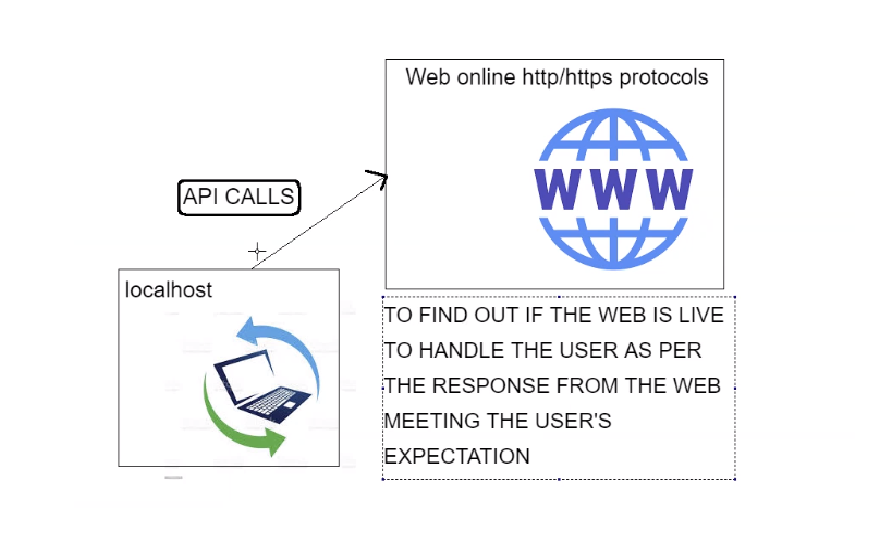
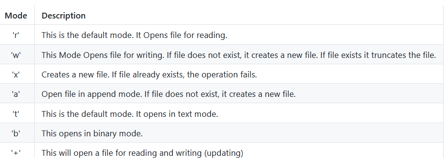

# Python Modules
This lesson covers python and its modules as well as pip

## Python Library and built in functions
- Python has a library of functions built into it.
- To access these functions they must be imported using the following syntax.
```
import <function_name> 
```
alternatively you can use this
```
from <function_name> import <function>
```
Using this method will change the way which you call the function within your code. Each is displayed below.
#### **First Iteration**
```
import random
print(random.random())  # generates float number between 0 and 1
```
#### **Second Iteration**
```
# from random import random
# print(random())
```
## What is pip and how we use it?
- Package manager for Python
- Installed through terminal
- Helps us install external packages e.g requests
- Syntax : pip install <name of package> e.g
```
pip install requests
```

## APIs within Python

- Built in functions help accelerate our development of software


- How can we create a customised method and utilise the built in functionality at the same time
- When and why should we do that
```
def current_system_path():
    print(f"this is your current directory \n {sys.path}")
current_system_path()

```
#### Importing requests to make an api call to www

- For this process we had to pip install the requests module as well as emoji.
- success code 200 represents a live site so in this code if status code is 200 we return a statement saying "Mission Successful!"
- if any other code is reported the else statement will run.
#### First Iteration
```
import requests
import emoji

live_response = requests.get("https://www.bbc.co.uk/")
# it provides an integer as a response code
if live_response.status_code == 200:
    print('Mission Successful!', emoji.emojize(":thumbs_up:"), str(live_response.status_code))

else:
    print("oops something went wrong... ")
```
#### Second Iteration
- In this iteration the code is put into a function in order to more easily call it without having DRY code.
```
def check_response_code():
    if live_response.status_code == 200:
        print('Mission Successful!', emoji.emojize(":thumbs_up:"), str(live_response.status_code))
    elif live_response.status_code == 404:
        print(" the site in unavailable util further notice. Please come back later")
    else:
        print("oops something went wrong... ")
```
#### Third Iteration
```
def check_response_code():
    if live_response.status_code:  # Will evaluate as true if the code is between 200-400, otherwise false
        print('Mission Successful!', emoji.emojize(":thumbs_up:"), str(live_response.status_code))
    elif live_response.status_code == 404:
        print(" the site in unavailable util further notice. Please come back later")
    else:
        print("oops something went wrong... ")
```
- as mentioned in the pseudo code, ```live_response.status_code:``` will return true if the code is between 200 and 400.
## Requests
- Requests help us manage API (Application Programming Interfaces)
- http and https are protocols that are used to send, receive, interact with data that is live on the web
- success code 200 : site is live
- error code 404 : site is down

## Json basics
- JSON (Java Script Object Notation)
- use cases - browser data
- data is in key value pairs
- Json encoding from a dictionary
- Json decoding into a dictionary
- handling/creating files with python
- writing to file
- reading from file

### Handling files and permissions

- Syntax - ```open("<file_name>", <mode>)```
## Exception handling
- ```try```and ```except```
- ```raise``` and ```finally```
- `try:` Attempts to run the block to check for errors
- `except:` If the try block fails the except block runs
- `else:` Executed after the try if nothing fails
- `finally:` Executed regardless of outcome of try
- `raise Exception("<message>")` Raises an error with an optional message.

### Common errors
- ValueError (Raised when an operation or function receives an argument that has the right type but an inappropriate value, and the situation is not described by a more precise exception such as IndexError.)
- NameError (Raised when a local or global name is not found. This applies only to unqualified names. The associated value is an error message that includes the name that could not be found.)
- IndentationError (Base class for syntax errors related to incorrect indentation. This is a subclass of SyntaxError.)
- SyntaxError (Raised when the parser encounters a syntax error.)
- TypeError (Raised when an operation or function is applied to an object of inappropriate type. The associated value is a string giving details about the type mismatch.)

### Use cases
- These blocks are used when we expect an error or exception to occur within the python interpreter
- This helps us handle the errors of exception and add a customised message
- Make a decision based on customer needs

#### Iteration 1
```
try: # lets use try block for one line of code where we know an error will be raised
    file = open("orders.text")
except:
    print("Error")
```
#### Iteration 2 using ```raise``` and ```finally```
```
try:
    file = open("orders.text")
except FileNotFoundError as err: #creating alias for FileNotFound error in except block
    print(f"Please create an 'orders.text' file" + str(err))

# if we want to see the actual exception together with customised message
    raise

finally: # finally executes regardless of the above conditions
    print("Finally message")
```