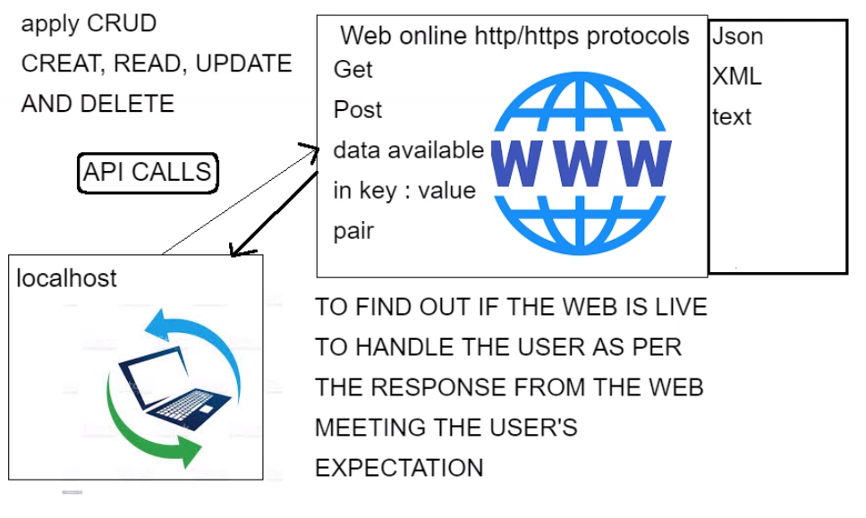

# Python Modules
This lesson covers python and its modules as well as pip

## Python Library and built in functions
- Python has a library of functions built into it.
- To access these functions they must be imported using the following syntax.
```
import <function_name> 
```
alternatively you can use this
```
from <function_name> import <function>
```
Using this method will change the way which you call the function within your code. Each is displayed below.
####**First Iteration**
```
import random
print(random.random())  # generates float number between 0 and 1
```
####**Second Iteration**
```
# from random import random
# print(random())
```
## What is pip and how we use it?
- Package manager for Python
- Installed through terminal
- Helps us install external packages e.g requests
- Syntax : pip install <name of package> e.g
```
pip install requests
```

## APIs within Python

- Built in functions help accelerate our development of software


- How can we create a customised method and utilise the built in functionality at the same time
- When and why should we do that
```
def current_system_path():
    print(f"this is your current directory \n {sys.path}")
current_system_path()

```
#### Importing requests to make an api call to www

- For this process we had to pip install the requests module as well as emoji.
- success code 200 represents a live site so in this code if status code is 200 we return a statement saying "Mission Successful!"
- if any other code is reported the else statement will run.
```
import requests
import emoji

live_response = requests.get("https://www.bbc.co.uk/")
# it provides an integer as a response code
if live_response.status_code == 200:
    print('Mission Successful!', emoji.emojize(":thumbs_up:"), str(live_response.status_code))

else:
    print("oops something went wrong... ")
```
#### Second Iteration
- In this iteration the code is put into a function in order to more easily call it without having DRY code.
```
def check_response_code():
    if live_response.status_code == 200:
        print('Mission Successful!', emoji.emojize(":thumbs_up:"), str(live_response.status_code))
    elif live_response.status_code == 404:
        print(" the site in unavailable util further notice. Please come back later")
    else:
        print("oops something went wrong... ")
```
#### Third Iteration
```
def check_response_code():
    if live_response.status_code:  # Will evaluate as true if the code is between 200-400, otherwise false
        print('Mission Successful!', emoji.emojize(":thumbs_up:"), str(live_response.status_code))
    elif live_response.status_code == 404:
        print(" the site in unavailable util further notice. Please come back later")
    else:
        print("oops something went wrong... ")
```
- as mentioned in the pseudo code, ```live_response.status_code:``` will return true if the code is between 200 and 400.
## Requests
- Requests help us manage API (Application Programming Interfaces)
- http and https are protocols that are used to send, receive, interact with data that is live on the web
- success code 200 : site is live
- error code 404 : site is down

